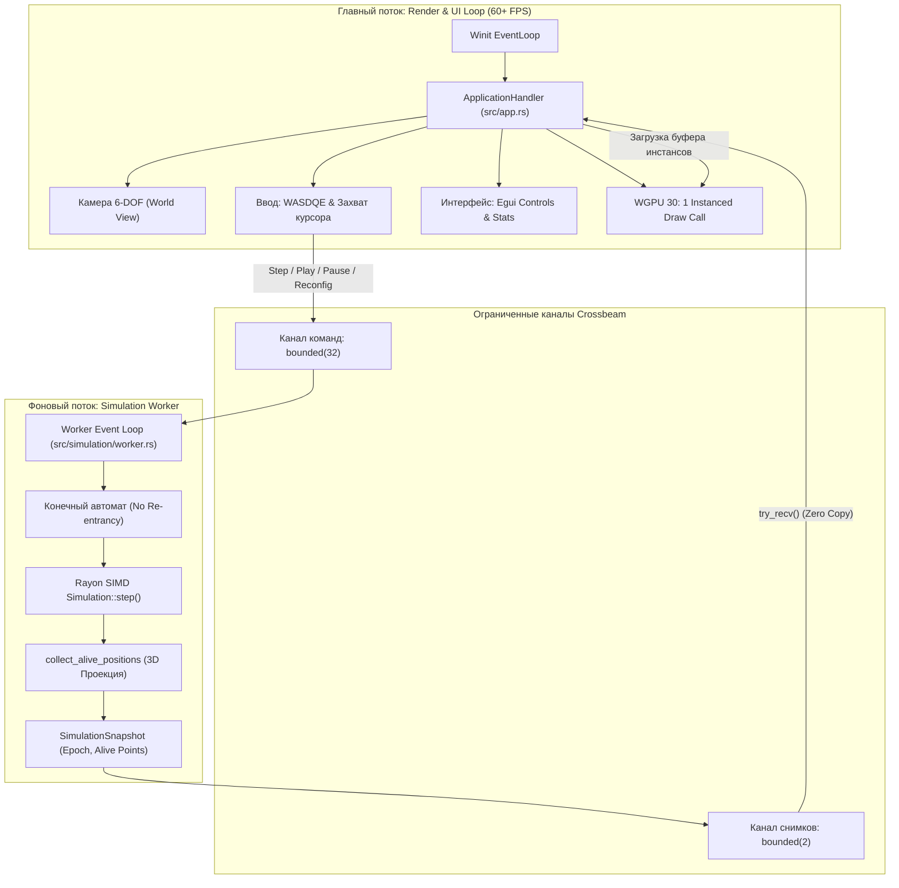

# 🌌 6D Game of Life (Rust + WGPU)

[](https://www.rust-lang.org/)
[](https://wgpu.rs/)
[](https://github.com/emilk/egui)
[]()
[]()
[]()

Высокопроизводительный движок и интерактивный 3D-визуализатор многомерного клеточного автомата «Игра Жизнь» (от 1D до 6D, с внутренней математической поддержкой до 40D) на языке Rust с аппаратным рендерингом через `wgpu` (Metal, Vulkan, DirectX 12) и адаптивным графическим интерфейсом на `egui`.

Проект является глубоким реинжинирингом и развитием оригинального Java / JavaFX 3D приложения, устраняющим фундаментальные архитектурные ограничения JVM и достигающим стабильных **60+ FPS** при десятках и сотнях тысяч живых клеток.

---

## 📑 Содержание

1. [Особенности проекта](#-особенности-проекта)
2. [Предыстория и сравнение с Java](#-предыстория-и-сравнение-с-java)
3. [Математическая модель](#-математическая-модель)
   - [Многомерный гиперкуб и окрестность Мура](#многомерный-гиперкуб-и-окрестность-мура)
   - [Динамические процентные правила](#динамические-процентные-правила)
   - [Топологии: Периодический n-тор (PBC) vs Ограниченное пространство](#топологии-периодический-n-тор-pbc-vs-ограниченное-пространство)
4. [3D-проекция гиперпространства](#-3d-проекция-гиперпространства)
5. [Хроматическая визуализация (Цветовое кодирование срезов)](#-хроматическая-визуализация-цветовое-кодирование-срезов)
6. [Архитектура системы и многопоточность](#-архитектура-системы-и-многопоточность)
7. [Формат сохранения состояний (.gol6d)](#-формат-сохранения-состояний-gol6d)
8. [Управление и горячие клавиши](#-управление-и-горячие-клавиши)
9. [Сборка и запуск](#-сборка-и-запуск)
10. [Производительность и бенчмарки](#-производительность-и-бенчмарки)
11. [Структура репозитория и документация](#-структура-репозитория-и-документация)

---

## 🚀 Особенности проекта

- ⚡ **Максимальная производительность симуляции**:
  - Линейное непрерывное хранилище `ByteGrid` (`u8` на ячейку) без косвенных ссылок, полностью помещающееся в L2-кэш процессора ($46\,656$ ячеек для 6D size=6 занимают всего **45.5 КБ**).
  - Разделяемая свертка (Separable Convolution) со сложностью $O(D \cdot 3 \cdot N)$ вместо наивного $O(3^D \cdot N)$.
  - Векторизация SIMD (ARM64 NEON и x86_64 AVX2) и параллельные вычисления через пул потоков `rayon`.
  - **Ноль динамических аллокаций** памяти в горячем цикле перехода поколений.
- 🎮 **Современный GPU-пайплайн (WGPU 30)**:
  - **Ровно 1 Instanced Draw Call** на кадр для всей многомерной вселенной вместо сотен тысяч объектов сцены.
  - Освещение Blinn-Phong с мягким рассеянным и фоновым светом для четкой читаемости граней кубов.
  - Камера свободного полета (6-DOF Fly-Camera) в стиле редактора Unity с поддержкой захвата курсора (FPS mouselook).
- 🌈 **Хроматическое внедрение гиперкоординат (Hyperdimensional Coloring)**:
  - 3-осевое разложение гиперкоординат в цветовое пространство: срезы по 4-му, 5-му и 6-му измерениям окрашиваются в уникальные спектральные оттенки (Coral, Emerald, Sapphire).
  - Нулевые накладные расходы: восстановление гиперкоординат за $O(1)$ целочисленных делений без сохранения тяжелых векторов.
- 🌐 **Двойная топология пространства**:
  - **Периодический n-тор (PBC / $\mathbb{T}^D$)**: бесшовное тороидальное замыкание границ по всем $D$ координатным осям без краевых эффектов.
  - **Ограниченное пространство (Hard Bounds)**: замкнутый гиперкуб с фиксированными границами.
- 🧵 **Многопоточная акторная модель (Worker Thread)**:
  - Поток рендеринга и интерфейса **никогда не блокируется** симуляцией (гарантированные 60+ FPS независимо от размера сетки).
  - Ограниченные crossbeam-каналы с передачей владения снимком (`SimulationSnapshot`) без копирования в куче (Zero Heap Copy).
  - Монотонный конечный автомат с защитой от накопления очереди (backlog) и пропусков кадров (anti-burst).
  - Версионирование через счетчик эпох (`epoch`) для гарантированного устранения гонок данных (data races) и устаревших снимков.
- 💾 **Ультракомпактная бинарная сериализация (`.gol6d`)**:
  - 1 бит на клетку (битпакинг) + Deflate-сжатие максимального уровня + аппаратный CRC32.
  - Степень сжатия **более 99%**: полное состояние 6D-сетки занимает **200–500 байт**.
  - Нативные диалоговые окна операционной системы (`rfd`) и быстрый автосохраняемый каталог `dumps/`.
- 🎛 **Адаптивный UI на Egui 0.36**:
  - Управление воспроизведением (Play / Pause / Step / Randomize) и логарифмический слайдер скорости (0.5 – 60 шагов/сек).
  - Слайдеры размерности (1D–6D), размера ребра с защитой от перегрузки GPU, зазора `delta` и порогов перехода.
  - Режим «Экстремальный размер» (разблокировка до 40 в 6D и до 2000 в 1D).
  - HUD-панель подсказок захвата мыши и подробная статистика (поколение, число живых клеток, время расчета шага в мс, FPS рендера).

---

## 📊 Предыстория и сравнение с Java

Оригинальная версия приложения была реализована на **Java / JavaFX 3D**. При переносе на Rust были решены критические проблемы исходного кода:

| Параметр | Оригинал на Java / JavaFX | Реализация на Rust (wgpu + rayon) |
| :--- | :--- | :--- |
| **Структура решетки** | 6-уровневое дерево указателей `boolean[][][][][][]` | Непрерывный линейный массив `ByteGrid` (`Vec<u8>`) в L2-кэше |
| **Аллокации в шаге** | До **34 000 000** объектов `int[6]` за шаг (`formatCounters`) | **0 байт** (все вычисления в регистрах процессора) |
| **Сложность свертки** | Брутфорс обход соседей: $O(3^6 \cdot N) = 729 \cdot N$ | Разделяемая свертка $O(6 \cdot 3 \cdot N) = 18 \cdot N$ + SIMD |
| **3D-рендеринг** | Отдельный объект `Box` на каждую ячейку (**157 464 ноды** в Scene Graph) | **1 Instanced Draw Call** в `wgpu`, буфер только для живых клеток |
| **Частота кадров (FPS)** | < 1–2 FPS на 6D сетках, постоянные GC-фризы | **60–120+ FPS** плавного рендера и свободной камеры |
| **Многопоточность** | Блокировка UI-потока JavaFX расчетами симуляции | Изолированный Worker-поток, неблокирующие каналы |
| **Цвет клеток** | Фиксированный `Color.DARKBLUE` для всех измерений | Спектральное 3-осевое хроматическое внедрение 4D–6D |
| **Сохранение состояния** | Отсутствовало | Бинарный формат `.gol6d` со сжатием >99% и CRC32 |

---

## 🧮 Математическая модель

### Многомерный гиперкуб и окрестность Мура

Пространство клеточного автомата представляет собой $D$-мерный гиперкуб со стороной $S$, где $D \in [1, 6]$ (координатная сетка поддерживает размерности до $40D$). Общее количество ячеек составляет:
$$N = S^D$$

Для каждой ячейки определяется $D$-мерная **окрестность Мура** (все ячейки, расстояние Чебышёва до которых равно 1). Общее число соседей (без учета центральной клетки):
$$\text{Neighbors}(D) = 3^D - 1$$

| Мерность $D$ | Число соседей $3^D - 1$ | Число клеток при $S=6$ |
| :---: | :---: | :---: |
| **1D** | 2 | 6 |
| **2D** | 8 | 36 |
| **3D** | 26 | 216 |
| **4D** | 80 | 1 296 |
| **5D** | 242 | 7 776 |
| **6D** | **728** | **46 656** |

### Динамические процентные правила

В отличие от классической 2D-игры «Жизнь» (B3/S23), переход состояния ячейки в многомерном пространстве задается процентными интервалами выживания и зарождения относительно общего числа соседей:

$$\text{count\_all} = \text{count\_live} + \text{count\_dead}$$
$$\text{min\_neighbors} = \left\lfloor \frac{\text{count\_all}}{100.0 / \text{percent\_min}} \right\rfloor$$
$$\text{max\_neighbors} = \left\lfloor \frac{\text{count\_all}}{100.0 / \text{percent\_max}} \right\rfloor$$

Клетка становится **живой** в следующем поколении тогда и только тогда, когда:
$$\text{min\_neighbors} \le \text{count\_live} \le \text{max\_neighbors}$$

По умолчанию установлены параметры: $\text{percent\_min} = 20.0\%$, $\text{percent\_max} = 45.0\%$.

### Топологии: Периодический n-тор (PBC) vs Ограниченное пространство

В симуляторе реализованы два топологических режима:

1. **Периодический n-тор (Periodic Boundary Conditions / $\mathbb{T}^D = (S^1)^D$)**:
   Координаты циклически замыкаются по всем $D$ осям:
   $$x_i' = (x_i \pm 1) \pmod S$$
   Пространство однородно и изотропно, краевые эффекты полностью отсутствуют, сохраняется трансляционная симметрия.
2. **Ограниченное пространство (Hard Bounds)**:
   Клетки за пределами диапазона $[0, S-1]$ считаются мертвыми (граничные условия Дирихле). Структуры отражаются или затухают у границ гиперкуба.

---

## 📐 3D-проекция гиперпространства

Для отображения $N$-мерного пространства ($D \le 6$) в видимом трехмерном мире используется каноническая проекционная сетка. Шесть координат $(a, b, c, d, e, f)$ отображаются в трехмерные мировые координаты $(X, Y, Z)$:

$$X = d + c \cdot (S + \delta)$$
$$Y = e + b \cdot (S + \delta)$$
$$Z = f + a \cdot (S + \delta)$$

где:
- $d, e, f$ — внутренние координаты ячейки внутри текущего 3D-блока ($d < S, e < S, f < S$);
- $c, b, a$ — макрокоординаты гиперсрезов:
  - $c$ — сдвиг вдоль оси $X$ (активно при $D \ge 4$);
  - $b$ — сдвиг вдоль оси $Y$ (активно при $D \ge 5$);
  - $a$ — сдвиг вдоль оси $Z$ (активно при $D = 6$);
- $\delta$ (`delta`) — настраиваемый визуальный зазор между гиперблоками в пространстве.

```text
 1D–3D:    Один центральный 3D-куб
 4D:       Цепочка 3D-блоков вдоль оси X (срез c)
 5D:       2D-матрица блоков в плоскости X–Y (срезы c, b)
 6D:       Полноценная 3D-решетка блоков в объеме X–Y–Z (срезы c, b, a)
```

---

## 🎨 Хроматическая визуализация (Цветовое кодирование срезов)

При отрисовке 4D–6D пространств в едином цвете все срезы визуально сливаются. Для кристальной читаемости топологии реализована система непрерывного хроматического внедрения:

| Размерность | Управляющие координаты | Пространство цвета | Назначение и визуальный эффект |
| :---: | :---: | :---: | :--- |
| **1D – 3D** | — | Deep Indigo | Классический однородный синий оттенок `[0.15, 0.45, 0.90]` |
| **4D** | $c$ (ось $X$) | HSV Gradient | Непрерывный спектральный градиент (Лазурный $\to$ Зеленый $\to$ Желтый $\to$ Красный) вдоль оси $X$ |
| **5D** | $c$ (ось $X$), $b$ (ось $Y$) | HSV Hue $\times$ Val | $c$ определяет цветовой тон (Hue); $b$ регулирует насыщенность и яркость строк срезов |
| **6D** | $c$ (4-я), $b$ (5-я), $a$ (6-я) | RGB Chromatic Embedding | **3-осевое спектральное разложение**: $c \to \text{Красный}$ (Coral), $b \to \text{Зеленый}$ (Emerald), $a \to \text{Синий}$ (Sapphire) |

### Формула хроматического внедрения для 6D:

$$\hat{c} = \frac{c}{\max(S - 1, 1)}, \quad \hat{b} = \frac{b}{\max(S - 1, 1)}, \quad \hat{a} = \frac{a}{\max(S - 1, 1)}$$
$$R = 0.18 + 0.78 \cdot \hat{c}, \quad G = 0.18 + 0.78 \cdot \hat{b}, \quad B = 0.25 + 0.72 \cdot \hat{a}$$

> [!NOTE]
> Восстановление гиперкоординат $(a, b, c)$ из проекционных координат $(X, Y, Z)$ выполняется в рендерере за **$O(1)$ без аллокаций** через целочисленное деление на шаг $\text{stride} = S + \delta$:
> $$c = \lfloor X / \text{stride} \rfloor, \quad b = \lfloor Y / \text{stride} \rfloor, \quad a = \lfloor Z / \text{stride} \rfloor$$

Также доступен классический режим `Uniform` (темно-синий цвет `[0.0, 0.0, 0.545]`), полностью эквивалентный палитре JavaFX.

---

## 🏛 Архитектура системы и многопоточность

Приложение разделено на два строго изолированных слоя исполнения, общающихся через ограниченные каналы `crossbeam`:



### Гарантии многопоточной модели:
1. **Отсутствие разделяемого состояния (No Shared State)**: структуры `Simulation` и `Grid` не оборачиваются в `Arc<Mutex<T>>`. Доступ к сетке имеет исключительно `SimulationWorker`, что исключает contention и data races.
2. **Передача снимка по значению (Zero Heap Copy)**: передача вектора координат живых клеток через канал перемещает лишь 24-байтный дескриптор без перевыделения буферов.
3. **Монотонность поколений**: воркер не начинает вычисление поколения $K+1$, пока снимок поколения $K$ не освободит очередь.
4. **Счетчик эпох (`epoch`)**: при переконфигурации гиперкуба или смене мерности старые снимки отбрасываются главным потоком по номеру эпохи, исключая артефакты запаздывания.

---

## 💾 Формат сохранения состояний (`.gol6d`)

Для сохранения и обмена конфигурациями клеточного автомата разработан бинарный формат `.gol6d`:

- **Фиксированный заголовок (60 байт)**:
  - Магическая сигнатура: `GOL6` (4 байта);
  - Версия формата: `1` (1 байт);
  - Метод сжатия: `1` (Deflate bitpacked, 1 байт);
  - Флаги топологии (1 байт: PBC / Bounded);
  - Режим цвета (1 байт: Hyperdimension / Uniform);
  - Параметры сетки: размерность $D$, размер ребра $S$, зазор $\delta$, generation (u64);
  - Правила: `percent_min`, `percent_max` (f64);
  - Метаданные: число живых клеток (u64), общий объем (u64);
  - Контрольная сумма: аппаратно-вычисляемый **CRC32** (4 байта).
- **Сжатие полезной нагрузки**:
  - Битпакинг: 1 бит на клетку (8 клеток на байт);
  - Сжатие потока через Deflate с максимальным уровнем сжатия (`Compression::best()`).
- **Эффективность сжатия**:
  - Состояние сетки $6^6 = 46\,656$ клеток занимает в файле всего **200–500 байт** (степень сжатия **>99%**).
  - Сетка $8^6 = 262\,144$ клеток сжимается до **6.6 КБ**.

> [!TIP]
> Приложение поддерживает как быстрое автосохранение одной кнопкой в локальную папку `dumps/`, так и стандартные диалоговые окна ОС «Сохранить как...» и «Открыть...» через библиотеку `rfd`.

---

## 🕹 Управление и горячие клавиши

### Управление камерой

| Клавиша / Действие | Действие |
| :--- | :--- |
| **W / S** | Движение вперед / назад вдоль вектора взгляда камеры |
| **A / D** | Стрейф влево / вправо |
| **Space / E** | Подъем вверх относительно взгляда |
| **Shift / Q** | Спуск вниз относительно взгляда |
| **Зажатие ЛКМ + мышь** | Вращение камеры (Pitch / Yaw) в режиме свободного курсора |
| **ПКМ / Кнопка камеры** | Включить режим захвата мыши (FPS Mouselook) |
| **Escape** | Освободить курсор мыши и вернуть управление интерфейсу |

### Управление симуляцией

| Клавиша | Действие |
| :--- | :--- |
| **Space / Enter** | Вычислить ровно один шаг симуляции |
| **P** | Переключить режим автовоспроизведения (Play / Pause) |
| **R** | Сгенерировать случайное распределение живых клеток (Randomize Seed) |
| **1, 2, 3, 4, 5, 6** | Быстрое переключение размерности гиперпространства |

---

## 🛠 Сборка и запуск

### Требования
- Установленный компилятор **Rust** версии **1.75** или новее (`rustup`).
- Видеокарта с поддержкой одного из графических API: **Metal** (macOS), **Vulkan** (Linux/Windows), **DirectX 12** (Windows).

### 1. Запуск интерактивного графического приложения (GUI)

```bash
cargo run --release
```

> [!IMPORTANT]
> Для максимальной производительности всегда запускайте проект с флагом `--release`. В debug-режиме проверки границ и отсутствие LTO снижают скорость симуляции.

### 2. Запуск автономного CLI-раннера и бенчмарка

Для замера «чистой» производительности ядра симуляции без графической подсистемы доступен встроенный CLI-режим:

```bash
cargo run --release -- --cli
```

### 3. Запуск автоматических тестов

Набор тестов включает 70 модульных, интеграционных, стресс- и оракул-тестов:

```bash
cargo test
```

### 4. Запуск микро-бенчмарков Criterion

```bash
cargo bench
```

---

## 📈 Производительность и бенчмарки

Замеры производительности выполнены на архитектуре Apple Silicon (ARM64 NEON) для сетки 6D ($6^6 = 46\,656$ ячеек, 728 соседей на клетку):

| Операция | Время выполнения | Пропускная способность |
| :--- | :---: | :---: |
| **6D Rayon Parallel Step** | **~2.8 – 3.4 мс** | **~15 – 17 Mcells/s** |
| **6D Sequential Step** | ~14.1 мс | ~3.3 Mcells/s |
| **4D Step (size=6, 1 296 клеток)** | **~35 мкс** | **~37 Mcells/s** |
| **3D Step (size=10, 1 000 клеток)** | **~22 мкс** | **~45 Mcells/s** |
| **1D Step (size=100, 100 клеток)** | **~0.6 мкс** | **~160 Mcells/s** |
| **3D Проекция живых клеток** | **~120 мкс** | ~20 000 точек |
| **Генерация буфера GPU инстансов** | **~85 мкс** | ~20 000 вершин |
| **GPU Render Pass (WGPU 30)** | **< 1.0 мс** | **60+ FPS стабильно** |

---

## 📁 Структура репозитория и документация

```text
6D_game_of_life_Rust/
├── Cargo.toml                              # Манифест зависимостей и профилей сборки
├── README.md                               # Главная документация проекта
├── RUST_APPLICATION_ARCHITECTURE.md        # Детальная архитектура Worker-потока и акторной модели
├── RUST_CORE_ARCHITECTURE.md               # Математическая спецификация ядра и layout сетки
├── RUST_RENDERER_ARCHITECTURE.md           # Архитектура WGPU-конвейера, инстансинга и камеры
├── RUST_HYPERDIMENSION_VISUALIZATION.md    # Математика хроматического цветового внедрения 4D–6D
├── RUST_PORT_SPECIFICATION.md              # Полная спецификация миграции с Java на Rust
├── dumps/                                  # Каталог примеров сохраненных состояний (.gol6d)
├── benches/
│   └── simulation_bench.rs                 # Набор микро-бенчмарков Criterion
├── src/
│   ├── lib.rs                              # Публичный интерфейс библиотеки
│   ├── main.rs                             # Точка входа (GUI / CLI флаг)
│   ├── app.rs                              # Главный цикл Winit ApplicationHandler
│   ├── input/
│   │   ├── mod.rs
│   │   └── input_state.rs                  # Обработка клавиатуры и захвата мыши
│   ├── projection/
│   │   ├── mod.rs
│   │   └── projection.rs                   # 3D проекция гиперпространства и VisualBounds
│   ├── renderer/
│   │   ├── mod.rs
│   │   ├── camera.rs                       # 6-DOF Fly-Camera с перспективной матрицей
│   │   ├── color.rs                        # Хроматическое внедрение гиперкоординат
│   │   ├── instance.rs                     # Преобразование координат в GPU InstanceRaw
│   │   ├── state.rs                        # WGPU инициализация, буферы и RenderPipeline
│   │   └── shader.wgsl                     # WGSL шейдер инстансированных кубов с освещением
│   ├── simulation/
│   │   ├── mod.rs
│   │   ├── coords.rs                       # Координатная сетка и шаги (strides) до 40D
│   │   ├── dump.rs                         # Бинарная сериализация .gol6d (Deflate + CRC32)
│   │   ├── engine.rs                       # SIMD и разделяемая свертка
│   │   ├── grid.rs                         # Линейный ByteGrid в L2-кэше
│   │   ├── rules.rs                        # Правила перехода поколений
│   │   ├── simulation.rs                   # Двойная буферизация (seq / par)
│   │   └── worker.rs                       # Фоновый SimulationWorker с Crossbeam каналами
│   └── ui/
│       ├── mod.rs
│       └── app_ui.rs                       # Интерфейс на Egui 0.36
└── tests/                                  # Интеграционные тесты
    ├── bounded_topology_test.rs            # Тесты ограниченного пространства
    ├── dump_test.rs                        # Тесты целостности и сжатия дампов
    ├── edge_size_test.rs                   # Тесты экстремальных размеров сетки
    ├── oscillation_size1_test.rs           # Тесты осцилляторов и стабильности
    ├── pbc_neighborhood_test.rs            # Тесты окрестностей на n-торе
    ├── pbc_oracle_test.rs                  # Математические оракул-тесты эквивалентности
    ├── renderer_test.rs                    # Тесты камеры, инстансинга и проекции
    ├── separable_test.rs                   # Верификация разделяемой свертки
    ├── stress_test.rs                      # Стресс-тесты жизненного цикла воркера
    └── worker_test.rs                      # Тесты монотонности и каналов воркера
```

---

## 📜 Лицензия

Проект распространяется под двойной лицензией **MIT** или **Apache-2.0** по вашему выбору.
