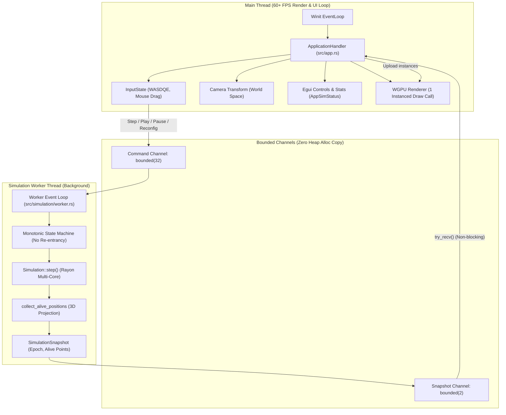

# Архитектура Приложения и Worker-потока (RUST_APPLICATION_ARCHITECTURE)

Документ описывает архитектуру многопоточного приложения `6D Game of Life`, разделение обязанностей между потоком визуализации/интерфейса и фоновым вычислительным worker-потоком, модель передачи данных, протоколы синхронизации и результаты аудита многопоточности.

---

## 1. Общий обзор архитектуры

Приложение разделено на два изолированных уровня исполнения:

1. **Главный поток визуализации и пользовательского интерфейса (Main/Render Thread)**:
   * Обрабатывает системные события Winit (`WindowEvent`).
   * Непрерывно обновляет положение камеры в мировых координатах (World Space) со скоростью дисплея (60+ FPS).
   * Отрисовывает интерфейс `egui`.
   * Выполняет ровно один instanced draw call на GPU через `wgpu`.
   * **Никогда не блокируется** тяжелыми расчетами клеточного автомата.
2. **Фоновый поток симуляции (Simulation Worker Thread)**:
   * Единолично владеет структурами `Simulation`, `Grid` и генератором случайных чисел `StdRng`.
   * Вычисляет поколения автомата (с использованием пула потоков `rayon`).
   * Выполняет 3D-проекцию координат живых клеток.
   * Производит неизменяемые снимки поколений (`SimulationSnapshot`).
   * Управляет собственной шкалой времени и таймером воспроизведения (Play/Pause).



---

## 2. Модель владения (Ownership) и жизненный цикл данных

* **Изоляция состояния**: Ни один объект симуляции (`Grid`, `Simulation`) не оборачивается в `Arc<Mutex<T>>`. Доступ к решетке автомата имеет исключительно поток `SimulationWorker`. Это полностью исключает data races и contention блокировок.
* **Передача снимка (Zero Heap Copy)**:
  * Воркер вычисляет шаг и собирает вектор 3D-координат живых клеток `alive_positions: Vec<(usize, usize, usize)>`.
  * Снимок `SimulationSnapshot` передается в канал `result_tx` по значению (ownership transfer). Перемещение 24-байтного дескриптора вектора не требует копирования данных в куче.
  * Главный поток принимает снимок через неблокирующий вызов `try_recv_snapshot()`.
  * После отправки воркер не может модифицировать переданный снимок, а поток рендера получает неизменяемый снимок.
  * Никаких циклических ссылок или разделяемой разделяемой памяти.

---

## 3. Протокол команд (`SimulationCommand`)

Главный поток передает управляющие сигналы через ограниченный канал `cmd_tx` (емкость 32):

```rust
pub enum SimulationCommand {
    /// Вычислить ровно одно поколение
    Step,
    /// Включить или выключить автоматическое воспроизведение
    SetPlaying(bool),
    /// Установить целевую скорость симуляции (поколений в секунду)
    SetSpeed(f32),
    /// Сгенерировать случайное состояние сетки с новым seed
    Randomize { epoch: u64, seed: Option<u64> },
    /// Полная переконфигурация гиперрешетки (размер, мерность, правила, зазор delta)
    Reconfigure {
        epoch: u64,
        size: usize,
        dimensions: usize,
        delta: usize,
        percent_min: f64,
        percent_max: f64,
        seed: Option<u64>,
    },
    /// Чистое завершение работы потока
    Shutdown,
}
```

### Гарантия неблокирующего вызова из Render Thread:
Метод `worker.send_command(cmd)` реализован с защитой от переполнения:
* Обычные команды (слайдер скорости, шаги) используют `try_send`. При экстремальной перегрузке промежуточные тики ползунка отбрасываются, не задерживая кадр.
* Критические команды жизненного цикла (`Shutdown`, `Reconfigure`, `Randomize`) используют короткий ограниченный таймаут (5 мс), что предотвращает зависание потока отрисовки даже в случае временной паузы воркера.

---

## 4. Строгий порядок поколений и конечный автомат воркера

В ходе concurrency-аудита была обнаружена и устранена потенциальная проблема гонки переупорядочивания снимков (re-entrancy interleaving), когда рекурсивная обработка команды `Step` внутри ожидания канала могла доставить снимок поколения $K+1$ раньше поколения $K$.

Текущая реализация построена на базе **нерекурсивного конечного автомата** с полем `pending_snapshot`:
1. Если канал результатов полон (`result_tx.is_full()`), готовый снимок сохраняется в `ctx.pending_snapshot`.
2. **Воркер никогда не начинает расчет следующего поколения, пока предыдущий снимок не доставлен в очередь.**
3. Это математически гарантирует строгую монотонность номеров поколений:
   $$\text{gen}_0 < \text{gen}_1 < \text{gen}_2 < \dots < \text{gen}_N$$
4. Если во время ожидания освобождения канала поступает команда `Reconfigure` или `Randomize`, устаревший `pending_snapshot` старой конфигурации **немедленно отбрасывается**, предотвращая отправку неактуальных данных.

---

## 5. Планировщик Play / Pause и защита от Backlog

* **Расписание во времени**: Скорость задается в поколениях в секунду ($1 - 60$ gen/s):
  $$\Delta t = \frac{1}{\text{speed\_fps}}$$
* **Защита от накопления очереди (Backlog Prevention)**:
  Если вычисление поколения заняло больше времени, чем интервал $\Delta t$ (например, на тяжелой сетке 6D size=7 шаг занял 80 мс при запросе 30 gen/s), планировщик не накапливает очередь пропущенных тиков, а сбрасывает время следующего шага:
  $$\text{next\_step\_time} = \text{now} + \Delta t$$
* **Исключение скачков скорости (Anti-burst)**:
  При ручном нажатии кнопки `Step` во время воспроизведения (Play), интервал следующего авто-шага отодвигается на $\Delta t$, исключая сдвоенный расчет шагов подряд.

---

## 6. Версионирование конфигураций (Simulation Epochs)

Для защиты от применения устаревших снимков используется монотонный счетчик эпох `epoch`:

```text
Пользователь выбрал размерность 1D (была 6D)
  │
  ├── Main thread: current_epoch += 1 (например, 2 -> 3)
  ├── Main thread sends Reconfigure { epoch: 3, ... }
  ├── Main thread выставляет статус AppSimStatus::Reconfiguring
  │
  ├── Воркер завершает старый шаг эпохи 2
  ├── При считывании команды Reconfigure старый снимок эпохи 2 сбрасывается
  ├── Воркер создает сетку 1D и отправляет снимок gen 0 эпохи 3
  │
  ├── Main thread считывает снимки:
  │   Если snap.epoch < current_epoch — СНИМОК БЕЗОПАСНО ИГНОРИРУЕТСЯ
  │   Если snap.epoch == current_epoch — СНИМОК ПРИМЕНЯЕТСЯ
  └── Main thread переводит статус в AppSimStatus::Paused / Playing
```

---

## 7. Состояния интерфейса (`AppSimStatus`)

Интерфейс пользователя четко различает 4 взаимоисключающих состояния:

| Состояние | Описание | Индикатор в UI |
| :--- | :--- | :--- |
| `Paused` | Симуляция остановлена, ожидается ввод пользователя | `⏸ На паузе (Paused)` |
| `Playing` | Включено автоматическое воспроизведение по таймеру | `▶ Воспроизведение (Playing)` |
| `Computing` | Процессор прямо сейчас вычисляет поколение | `⚙ Вычисление поколения (Computing)...` |
| `Reconfiguring` | Выполняется пересоздание сетки / смена мерности | `🔄 Переконфигурация сетки (Reconfiguring)...` |

---

## 8. Безопасность при закрытии (Clean Shutdown)

1. При закрытии окна (`WindowEvent::CloseRequested`):
   * Вызывается `worker.shutdown()`.
   * В канал команд отправляется `SimulationCommand::Shutdown` с таймаутом.
   * Выполняется `handle.join()`.
   * Процесс гарантированно освобождает все ресурсы операционной системы без висячих потоков.
2. Типаж `Drop` для `SimulationWorker` делает вызов `shutdown()` идемпотентным и безопасным при панике или выходе из области видимости.
3. Канал команд и канал снимков корректно обрабатывают закрытие противоположного конца через варианты `Disconnected`.
